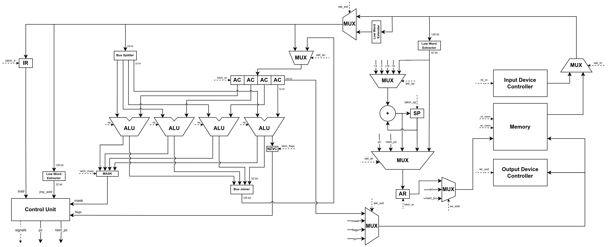
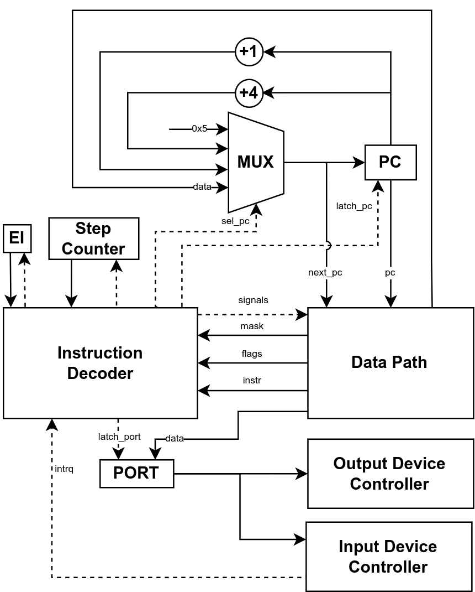

# csa-lab4

- **Ведехин Александр Вадимович P3218**
- Вариант: `lisp | acc | neum | hw | tick | binary | trap | port | cstr | prob1 | vector`

## Язык программирования

Язык программирования реализован по подобию Lisp, отличительной чертой которого является запись кода в виде S-выражений.

### Описание синтаксиса

``` ebnf
<digit> ::= [0-9]
<positive-number> ::= <digit> | <digit> <positive-number>
<number> ::= <positive-number>
           | "+" <positive-number>
           | "-" <positive-number>

<string-char> ::= [^"]
<string-char-seq> ::= "" | <string-char> <string-char-seq>
<string> ::= "\"" <string-char-seq> "\""

<nondigit-char> ::= [A-Za-z!$%+\-&*.\/<=>?@\[\]^_{}~]
<char> ::= <digit> | <nondigit-char>
<char-seq> ::= <char> | <char> <char-seq>
<symbol> ::= <nondigit-char>
           | <char-seq> <nondigit-char>
           | <char-seq> <nondigit-char> <char-seq>

<function-call> ::= <symbol> | <symbol> <expression-list>

<memory-allocation> ::= "allocate-string" <number>
                      | "allocate-array" <number>

<variable-definition> ::= "defvar" <number>
                        | "defvar" <string>
                        | "defvar" "(" <memory-allocation> ")"

<parameter-list> ::= "" | <symbol> | <symbol> <parameter-list>
<declare-list> ::= "" | "(" "declare" <expression> ")" <declare-list>
<function-body> ::= <declare-list> <expression-list>
<function-definition> ::= "defun" <symbol> "(" <parameter-list> ")" <function-body>

<variable-list> ::= "" | "(" <symbol> <expression> ")" <variable-list>
<let-block> ::= "let" "(" <variable-list> ")" <expression-list>

<if-expression> ::= "if" <expression> <expression>
                  | "if" <expression> <expression> <expression>

<special-form> ::= <memory-allocation>
                 | <let-block>
                 | <if-expression>
                 | "setq" <symbol>
                 | "read-char" <symbol> <expression>
                 | "write-char" <symbol> <expression> <expression>
                 | "read-array-element" <symbol> <expression>
                 | "write-array-element" <symbol> <expression> <expression>
                 | "input" <positive-number>
                 | "output" <positive-number> <expression>

<comment> ::= ";" [^\n]* <newline>

<expression> ::= <number>
               | <string>
               | <symbol>
               | "(" <function-call> ")"
               | "(" <special-form> ")"
<expression-list> ::= <expression> | <expression> <expression-list>

<top-level> ::= "(" <variable-definition> ")"
              | "(" <function-definition> ")"

<program> ::= ""
            | <expression> <program>
            | <top-level> <program>
            | <comment> <program>
```

### Описание семантики

#### Стратегия вычислений

Аргументы вычисляются до передачи в функцию (строгая модель вычислений). При вызове функции и объявлении переменных в блоке `let` значения выражений вычисляются справа налево, в остальных случаях — слева направо.

#### Пространства имен

Пространства имен функций и переменных разделены. Использование одного из них определяется по контексту: выражение вида `<ident>` считается обращением к переменной, а выражение вида `(<ident> <arg0> <arg1> ...)` — вызовом функции.

#### Области видимости

Для функций доступна глобальная область видимости, для переменных — глобальная и локальная.

Функции и переменные с глобальной областью видимости определяются с использованием выражений верхнего уровня `defun` и `defvar` соответственно. Они доступны во всем тексте программы. Имена двух глобальных переменных или двух функций не могут совпадать.

Переменные с локальной областью видимости являются параметрами функции, объявленными в `defun`, или переменными определенными в `let`. Они доступны внутри функции или `let`-блока соответственно. Имена двух переменных не могут совпадать в пределах одного объявления.

Переменная в локальной области видимости может затенять переменные из внешних областей, если обладает тем же именем. В таком случае операции в данной области видимости работают с новой переменной и их результат не отражается на значениях переменных с тем же именем за ее пределами.

#### Литералы

Доступны два вида литералов: 32-битные целые числа и строки. 
  
Целые числа, не умещающиеся в 32 бита, "обрезаются" до младших 32 бит.
  
Строки реализованы как C Strings — массивы байт, оканчивающиеся специальным символом с кодом `0`. В строках разрешены специальные символы `\n`, `\t` и `\0`, имеющие стандартное значение.

#### Типизация

Доступны три типа переменных: 32-битное целое число, указатель на строку и указатель на массив. Возможность явного указания типа отсутствует.

Типизация слабая динамическая. Тип переменной неявно преобразуется в зависимости от контекста использования.

#### Выражения

Все конструкции языка являются выражениями, возвращающими некоторое значение, за исключением специальных форм `defun`, `defvar` и `declare`, которые не могут быть использованы в качестве аргументов.

#### Встроенные функции

В язык встроены арифметические операции (`+`, `+c`, `-`, `*`, `/`, `%`), битовые операции (`<<`, `>>`, `&`, `|`, `^`, `~`) и операции сравнения (`=`, `/=`, `<`, `<=`, `>`, `>=`). Операция `+c` выполняет сложение операндов с флагом переноса, `/=` проверяет неравенство значений, остальные операции имеют стандартный функционал.

Операции сравнения возвращают `1` в случае успеха и `0` в случае неудачи.

Операция `~` принимает один аргумент, остальные — два.

#### Встроенные специальные формы

- `defun <func> (<param0> <param1> ...) <expr0> <expr1> ...` — определение функции;

- `defvar <var> <value>` — определение глобальной переменной;

- `declare (<property>)` — объявление о дополнительном свойстве функции:

  - `interrupt N` — устанавливает функцию обработчиком прерываний устройства ввода-вывода под номером `N`;

  - `optimize vector` — разрешает векторизацию функции;

- `allocate-string N` и `allocate-array N` — выделение статической памяти под строку и массив, имеющие длину `N`, соответственно, возвращает указатель на первый элемент;

- `setq <var> <value>` — присвоение значения переменной, возвращает присвоенное значение;

- `read-char <var> <index>` и `read-array-element <var> <index>` — чтение символа и числа из строки и массива соответственно, возвращает прочитанное значение;

- `write-char <var> <index> <value>` и `write-array-element <var> <index> <value>` — запись символа и числа в строку и массив соответственно, возвращает записанное значение;

- `input N` — чтение из устройства ввода-вывода под номером `N`, возвращает прочитанное значение;

- `output N <value>` — запись в устройство ввода-вывода под номером `N`, возвращает записанное значение;

- `if <cond> <main-branch> [<alt-branch>]` — ветвление на основе предоставленного условия (если значение условия равно `0`, выполняется альтернативная ветвь, в остальных случаях — основная), возвращает значение исполненной ветви (если альтернативная ветвь отсутствует и условие не выполняется, то возвращает `0`);

- `let ((<var0> <value0>) (<var1> <value1>) ...) <expr0> <expr1> ...` — создание блока кода с локальными переменными, возвращает значение последнего выражения в блоке.

#### Прерывания

Для определения обработчика прерываний используется специальная форма `declare`. Обработчик прерываний не может иметь параметров. Обработчики прерываний для устройств ввода-вывода, номера которых отличны от `0`, игнорируются. В случае, если обработчик прерываний для устройства не определен, используется обработчик-заглушка, не выполняющий никаких полезных действий.

## Организация памяти

### Общая информация

Программа и данные размещаются в одном адресном пространстве (архитектура фон Неймана). Разработчик имеет доступ ко всей памяти.

Адресация байтовая. Для адресации используются 32-битные адреса, размер памяти ограничен $2^{32}$ байтами.

Размер машинного слова — 32 бита. Векторные инструкции позволяют прочитать из памяти до четырех машинных слов за раз.

В одном машинном слове могут храниться одно целое число или четыре символа. Целые числа хранятся в формате Little-endian.

Динамическое выделение памяти отсутствует.

Доступны четыре варианта адресации:

| Название                                            | Мнемоника | Описание                                                               | Пример                 |
| --------------------------------------------------- | --------- | ---------------------------------------------------------------------- | ---------------------- |
| Непосредственная                                    | `IMM`     | Данные хранятся непосредственно в самой команде                        | `LD 10`                |
| Прямая абсолютная                                   | `ADDR`    | Данные хранятся по указанному адресу                                   | `LD MEM[10]`         |
| Со смещением относительно указателя стека           | `SP`      | Данные хранятся на стеке по указанному смещению                        | `LD MEM[SP + 10]`      |
| Косвенная со смещением относительно указателя стека | `SP_IND`  | Данные хранятся по адресу, хранящемуся на стеке по указанному смещению | `LD MEM[MEM[SP + 10]]` |

### Структура программы
```
          Registers
+-------------------------------+
| AC                            |
+-------------------------------+

            Memory
+-------------------------------+
| 00  : jmp n                   |
| 05  : interruption vector 0   |
| 0A  : string literal 0 char 0 |
| 0B  : string literal 0 char 1 |
|    ...                        |
| l   : string literal 1 char 0 |
| l+1 : string literal 1 char 1 |
|    ...                        |
| m   : allocated memory byte 0 |
| m+1 : allocated memory byte 1 |
|    ...                        |
| v   : global variable 0       |
| v+4 : global variable 1       |
|    ...                        |
| i   : interruption handler    |
|    ...                        |
| f   : function body 0         |
|    ...                        |
| g   : function body 1         |
|    ...                        |
| n   : program start           |
|    ...                        |
| h   : HALT                    |
|    ...                        |
| s-4 : stack variable 1        |
| s   : stack variable 0        |
+-------------------------------+
```

#### Регистры

Разработчику доступен один 128-битный регистр общего назначения (аккумулятор). Скалярные команды работают только с младшими 32-мя битами регистра.

#### Заголовок программы

В начале программы зарезервированы 10 байт под заголовок.

По адресу `0x00` размещается безусловный переход на начало исполняемого кода.

Адрес `0x05` зарезервирован под вектор прерывания. По данному адресу хранится переход на начало обработчика прерываний или, в случае его отсутствия, заглушка в виде команды `IRET` и четырех байтов, заполненных нулями.

#### Строковые литералы

Начиная с адреса `0x0A` хранятся строковые литералы.

Все строковые литералы, исключая повторения, сохраняются транслятором в статическую память в порядке их обнаружения в коде программы. В одно машинное слово упаковываются четыре символа.

Адреса строковых литералов загружаются с использованием непосредственной адресации. Символы загружаются путем прибавления смещения к адресу литерала, сохранения полученного значения на стек и обращения к памяти с использованием `SP_IND` адресации.

#### Выделенная память

Следом за строками располагается статическая память, выделенная с использованием `allocate-string` и `allocate-array`. Изначально она заполнена нулями.

Доступ к данной памяти происходит аналогично работе со строковыми литералами по адресам, назначенным транслятором для каждой команды выделения памяти.

#### Глобальные переменные

Далее находятся глобальные переменные, каждая из которых занимает одно машинное слово.

Доступ к глобальным переменным осуществляется с использованием прямой абсолютной адресации.

#### Инструкции

Следом за глобальными переменными располагаются обработчик прерываний, пользовательские функции и основная программа. Некоторые функции могут быть встроены в тело программы.

Числовые литералы встраиваются в инструкции и загружаются с использованием непосредственной адресации.

#### Стек

Остальная часть выделенной памяти отведена под стек. В начальный момент времени указатель стека хранит адрес, идущий следом за адресом последней доступной ячейки памяти.

Стек используется для хранения локальных переменных, передачи аргументов функции, сохранения состояния при прерывании и доступа к элементам строк и массивов.

## Система команд

### Особенности процессора

Аккумуляторная архитектура процессора с векторными инструкциями. Результаты всех вычислений сохраняются в аккумулятор.

Инструкция без операнда занимает 1 байт, с операндом — 5 байт.

Векторные инструкции могут обрабатывать до четырех машинных слов за раз.

Port-mapped IO — ввод-вывод осуществляется с помощью специальных команд.  Доступно одно устройство ввода под номером `0` и два устройства вывода под номерами `1` (для символов) и `2` (для чисел).

Кроме аккумулятора, процессором используются следующие регистры:
- `PC` — указатель на текущую инструкцию или ее операнд;
- `EI` — регистр, хранящий состояние о том, разрешены ли прерывания;
- `PORT` — регистр, хранящий порт устройства ввода-вывода, с которым осуществляется взаимодействие;
- `IR` — регистр, хранящий опкод и режим адресации инструкции;
- `SP` — указатель на вершину стека;
- `AR` — регистр, хранящий адрес, по которому осуществляется чтение из памяти или запись в нее;
- `FLAGS` — 4-битный регистр хранящий флаги состояния:
  - флаг знака (`N`);
  - флаг нуля (`Z`);
  - флаг переполнения (`V`);
  - флаг переноса (`C`);
- `MASK` — 4-битный флаг, хранящий маску, позволяющую избирательно читать и записывать последовательные машинные слова в рамках одной векторной инструкции.

При включенных прерываниях и наличии сигнала о прерывании текущее состояние регистров `PC`, `MASK`, `FLAGS` и `AC` сохраняется на стек и происходит выполнение обработчика прерываний. Во время выполнения обработчика новые прерывания не могут быть приняты.

### Цикл исполнения инструкции

1. **Выборка инструкции** (1 такт): в регистр `IR` считывается опкод и режим адресации;
2. (Для инструкций с операндом) **Выборка адреса операнда**:
    1. **Прямая выборка адреса** (1 такт):
        - для `IMM`: в регистр `AR` записывается `PC + 1`;
        - для `ADDR`: в регистр `AR` записывается `MEM[PC + 1]`;
        - для `SP` и `SP_IND`: в регистр `AR` записывается `SP + MEM[PC + 1]`;
    2. (Для `SP_IND`) **Косвенная выборка адреса** (1 такт): в `AR` считывается `MEM[AR]`;
3. (Кроме инструкций перехода `J**`) **Исполнение инструкции**
4. **Переход** (0-1 тактов, может быть совмещен с исполнением инструкции): в `PC` записывается адрес следующей инструкции;
5. (Если выполнены необходимые условия) **Прерывание** (4 такта):
    1. Сохранение `PC` на стек;
    2. Сохранение `MASK` на стек;
    3. Сохранение `FLAGS` на стек;
    4. Сохранение `AC` на стек.

### Набор инструкций

| Опкод    | Мнемоника     | Адресация   | Кол-во тактов* | Описание             |
| :------: | ------------- | :---------: | :------------: | -------------------- |
| `000000` | `NOP`         |      -      | 2              | Пустая инструкция    |
| `000001` | `HALT`        |      -      | 2              | Остановка выполнения |
| `000010` | `LD <arg>`    |      +      | 3-4            | Загрузка машинного слова из памяти в `AC` |
| `000011` | `ST <arg>`    | Кроме `IMM` | 3-4            | Сохранение машинного слова из `AC` в память |
| `000100` | `ADD <arg>`   |      +      | 3-4            | `AC <- AC + <arg>`   |
| `000101` | `ADC <arg>`   |      +      | 3-5            | `AC <- AC + <arg> + C` |
| `000110` | `SUB <arg>`   |      +      | 3-4            | `AC <- AC - <arg>`   |
| `000111` | `CMP <arg>`   |      +      | 3-4            | Установка флагов на основе результата `AC - <arg>` |
| `001000` | `MUL <arg>`   |      +      | 3-4            | `AC <- AC * <arg>`   |
| `001001` | `DIV <arg>`   |      +      | 3-4            | `AC <- AC / <arg>`   |
| `001010` | `REM <arg>`   |      +      | 3-4            | `AC <- AC % <arg>`   |
| `001011` | `SHL <arg>`   |      +      | 3-4            | `AC <- AC << <arg>`  |
| `001100` | `SHR <arg>`   |      +      | 3-4            | `AC <- AC >> <arg>`  |
| `001101` | `AND <arg>`   |      +      | 3-4            | `AC <- AC & <arg>`   |
| `001110` | `OR <arg>`    |      +      | 3-4            | `AC <- AC \| <arg>`  |
| `001111` | `XOR <arg>`   |      +      | 3-4            | `AC <- AC ^ <arg>`   |
| `010000` | `NOT`         |      -      | 2              | `AC <- ~AC`          |
| `010001` | `PUSH`        |      -      | 3              | `SP <- SP - 4` <br> `MEM[SP] <- AC` |
| `010010` | `POP`         |      -      | 2              | `SP <- SP + 4` |
| `010011` | `JMP <addr>`  |    `IMM`    | 3              | `PC <- <addr>` |
| `010100` | `JEQ <addr>`  |    `IMM`    | 3              | `PC <- <addr>`, если `Z = 1` |
| `010101` | `JNE <addr>`  |    `IMM`    | 3              | `PC <- <addr>`, если `Z = 0` |
| `010110` | `JLT <addr>`  |    `IMM`    | 3              | `PC <- <addr>`, если `N ≠ V` |
| `010111` | `JLE <addr>`  |    `IMM`    | 3              | `PC <- <addr>`, если `N ≠ V` или `Z = 1` |
| `011000` | `JGT <addr>`  |    `IMM`    | 3              | `PC <- <addr>`, если `N = V` и `Z = 0` |
| `011001` | `JGE <addr>`  |    `IMM`    | 3              | `PC <- <addr>`, если `N = V` |
| `011010` | `CALL <addr>` |    `IMM`    | 4              | Вызов функции: <br> `SP <- SP - 4` <br> `MEM[SP] <- PC` <br> `PC <- <addr>` |
| `011011` | `RET`         |      -      | 4              | Возврат из функции: <br> `PC <- MEM[SP] + 4` <br> `SP <- SP + 4` |
| `011100` | `IRET`        |      -      | 6              | Возврат из обработчика прерываний: восстановление регистров `PC`, `MASK`, `FLAGS` и `AC` со стека и включение прерывания |
| `011101` | `IN <port>`   |    `IMM`    | 4              | Считывание значения из устройства под номером `<port>` в `AC` |
| `011110` | `OUT <port>`  |    `IMM`    | 4              | Запись значения из `AC` в устройство под номером `<port>` |
| `011111` | `VLD <arg>`   |      +      | 3-4            | Векторный аналог `LD` |
| `100000` | `VST <arg>`   | Кроме `IMM` | 3-4            | Векторный аналог `ST` |
| `100001` | `VADD <arg>`  |      +      | 3-4            | Векторный аналог `ADD` |
| `100010` | `VSUB <arg>`  |      +      | 3-4            | Векторный аналог `SUB` |
| `100011` | `VMUL <arg>`  |      +      | 3-4            | Векторный аналог `MUL` |
| `100100` | `VDIV <arg>`  |      +      | 3-4            | Векторный аналог `DIV` |
| `100101` | `VPUSH`       |      -      | 3              | `SP <- SP - 16` <br> `MEM[SP] <- AC` |
| `100110` | `VPOP`        |      -      | 2              | `SP <- SP + 16` |
| `100111` | `VMNOT`       |      -      | 2              | `MASK <- ~MASK` |
| `101000` | `VMEQ <arg>`  |      +      | 3-4            | Установка `MASK` на основе результата сравнения `AC = <arg>` |
| `101001` | `VMNE <arg>`  |      +      | 3-4            | Установка `MASK` на основе результата сравнения `AC /= <arg>` |
| `101010` | `VMLT <arg>`  |      +      | 3-4            | Установка `MASK` на основе результата сравнения `AC < <arg>` |
| `101011` | `VMLE <arg>`  |      +      | 3-4            | Установка `MASK` на основе результата сравнения `AC <= <arg>` |
| `101100` | `VMGT <arg>`  |      +      | 3-4            | Установка `MASK` на основе результата сравнения `AC > <arg>` |
| `101101` | `VMGT <arg>`  |      +      | 3-4            | Установка `MASK` на основе результата сравнения `AC >= <arg>` |
| `101110` | `VMLD <arg>`  |      +      | 3-4            | Загрузка из памяти в `AC` вектора машинных слов, для которых в `MASK` установлена `1` |
| `101111` | `VMST <arg>`  | Кроме `IMM` | 3-4            | Сохранение из `AC` в память вектора машинных слов, для которых в `MASK` установлена `1` |


\*Количество тактов записано без учета цикла прерывания

### Кодирование инструкций

#### Инструкция без операнда

```
┌─────────┬──────┐
│ 7     2 │ 1  0 │
├─────────┼──────┤
│  опкод  │  00  │
└─────────┴──────┘
```

#### Инструкция с операндом

```
┌───────────┬───────────┬───────────────────────────────┐
│ 39     32 │ 31     30 │ 29                          0 │
├───────────┼───────────┼───────────────────────────────┤
│   опкод   │   режим   │            операнд            │
└───────────┴───────────┴───────────────────────────────┘
```

## Транслятор

Реализован в модуле [translator](./src/translator/).

### Интерфейс командной строки

```
usage: python -m src.simulator [-h] -i INPUT -c CONFIG [-l LOG]

options:
  -h, --help            show this help message and exit
  -i INPUT, --input INPUT
                        Файл с машинным кодом
  -c CONFIG, --config CONFIG
                        Файл с конфигурацией
  -l LOG, --log LOG     Файл логов
```

### Этапы работы

#### 0. Подключение стандартной библиотеки

К файлу с кодом добавляется [стандартная библиотека](./src/translator/stdlib.lisp), реализующая функции вывода строк и массивов.

#### 1. Токенизация

Из файла последовательно считываются символы. При достижении завершающего символа происходит формирование токенов, а затем чтение продолжается.

Если первым символом нового токена является `"`, то завершающим символом выступает другой `"`. Оба символа `"`, а также символы между ними объединяются в один токен.

Если первым символом не является `"`, то завершающими символами могут выступать `;`, `(`, `)` и пробельные символы. При достижении каждого из них формируется токен из ранее прочитанных символов, если такие есть, а также выполняются дополнительные действия: при `;` следующие за ним символы в строке отбрасываются как комментарий; при `(` или `)` добавляется токен, содержащий только данный завершающий символ; пробельный символ отбрасывается.

#### 2. Построение абстрактного синтаксического дерева (АСД)

На основе прочитанных символов строится АСД, узлами которого могут выступать литералы, имена переменных, вызовы функций и встроенные специальные формы.

Кроме того производится name mangling: к именам переменных добавляется префикс `__`.

#### 3. Анализ

На данном этапе анализируется информация переданная через специальную форму `declare`, а также анализируется АСД на возможность применения следующих оптимизаций:

- **Хвостовая рекурсия**

  Хвостовым выражением считается выражение, которое:

  - находится в конечной позиции в теле функции;

  - является одной из ветвей условного оператора, являющегося хвостовым выражением;

  - находится в конечной позиции в теле `let`-блока, являющегося хвостовым выражением.

  Рекурсивные вызовы, являющиеся хвостовыми выражениями, помечаются как хвостовые вызовы.

- **Встраивание функций**

  Если все вызовы функции являются хвостовыми, за исключением одного нерекурсивного вызова, то этот вызов помечается как место куда может быть встроен код данной функции.

- **Векторизация функций**

  Функции, для которых разрешена векторизация специальной формой `declare`, могут быть помечены как векторизуемые при соблюдении определенных условий.

  Векторизуемые функции обладают следующей структурой:
  ```lisp
  (defun <func> (<param0> <param1> ... <ind> ...)
      (if (<cond> <ind> <bound-value>)
          <allowed-expression>
          <loop-end-code>))
  ```

  `<ind>` — это индуктивная переменная цикла, `<bound-value>` — ее верхняя или нижняя граница. В качестве `<bound-value>` могут выступать только числовые литералы и глобальные переменные.

  В качестве условия выхода цикла `<cond>` могут выступать функции `<`, `<=`, `>` или `>=`, на основе которых определяется, какая из ветвей является векторизуемым телом цикла (для `<` и `<=` — основная, для `>` и `>=` — альтернативная).
  
  В данной ветви могут использоваться только разрешенные выражения:

  - числовые литералы;

  - `let`-блоки;

  - чтение и запись локальных переменных, определенных в `let`-блоках;

  - чтение и запись глобальных массивов по индексу `<ind>` (индуктивная переменная цикла);

  - арифметические операции `+`, `-`, `*` и `/`;

  - невложенные операторы ветвления;

  - невложенные операции сравнения в качестве условий операторов ветвления;

  - хвостовые вызовы данной функции, в которые все параметры передаются без изменений, за исключением `<ind>`, который инкрементируется на `1`.

  Если не сказано обратное, то в качестве вложенных в них выражений могут выступать только другие разрешенные выражения.

  В качестве возвращаемого выражения векторизуемой ветви обязан выступать хвостовой вызов функции.

#### 4. Генерация машинного кода

В процессе генерации машинного кода в бинарный файл записываются все строковые литералы, выделенная память, глобальные переменные, генерируются обработчик прерываний и функции, а также машинный код основной программы.

Правила генерации машинного кода:

- **Строковые литералы, выделение памяти, глобальные переменные**

  Собираются транслятором в начале работы. Им присваиваются адреса в порядке нахождения.

- **Определение пользовательских функций**

  Для скалярных функций генерируется код для каждого выражения в теле функции и сохраняется адрес первой машинной инструкции для дальнейшего осуществления вызовов функции. В конце тела функции добавляется инструкция `RET` (`IRET`, если функция является обработчиком прерываний).

  Для векторных функций генерируется векторный код для обработки элементов массива, длина которого кратна `4` (длина вектора), скалярный код для обработки оставшихся элементов и завершающий код цикла. Так же, как и для скалярных функций, сохраняется адрес первой инструкции и добавляется инструкция `RET`.

- **Чтение и запись переменных и портов**

  Заменяются на соответствующие машинные инструкции (в случае работы с переменными внутри векторных функций используются их векторные аналоги).

- **Чтение и запись строк и массивов**

  Для данных операций генерируется следующий машинный код:
  ```
  ; (read-char s i)

  LD MEM[@i]
  ADD MEM[@s]
  PUSH

  LD MEM[MEM[SP + 0]]
  AND 0xFF
  
  POP


  ; (write-char s i value)

  LD MEM[@value]
  AND 0xFF
  PUSH

  LD MEM[@i]
  ADD MEM[@s]
  PUSH

  LD MEM[MEM[SP + 0]]
  AND 0xFFFFFF00
  OR MEM[SP + 4]
  ST MEM[MEM[SP + 0]]
  AND 0xFF

  POP
  POP


  ; (read-array-element arr i)

  LD MEM[@i]
  ADD MEM[@s]
  PUSH

  LD MEM[MEM[SP + 0]]
  POP


  ; (write-array-element arr i value)

  LD MEM[@i]
  ADD MEM[@s]
  PUSH

  LD MEM[@value]
  ST MEM[MEM[SP + 0]]
  POP
  ```

- **Арифметические и битовые операции**

  Заменяются на соответствующие машинные инструкции (в случае арифметических операций внутри векторных функций используются их векторные аналоги).
  
  Их первый аргумент загружается в аккумулятор. Второй аргумент, если есть, либо загружается из памяти в соответствии с его типом, либо вычисляется, кладется на стек и загружается с него.

  Пример:
  ```
  ; (+ 1 2)

  LD 1
  ADD 2

  ; (+ 1 <expression>)

  <expression-machine-code>
  PUSH
  LD 1
  ADD MEM[SP + 0]
  POP
  ```

- **Операции сравнения**

  Генерируемый код зависит от того, является ли родительская функция скалярной или векторной.

  Аргументы передаются аналогично арифметическим и битовым операциям.

  В скалярном коде сравнение реализовано с помощью инструкции `CMP` и инструкций ветвления `J**`, загружающий `1` в случае успеха и `0` в случае неудачи.

  Пример (`@` обозначает получение адреса метки):
  ```
  ; (> 10 var)

         LD 10
         CMP MEM[@var]  ; сравнение
         JGT @main      ; выбор ветви

         LD 0           ; неудача
         JMP @end
  main:
         LD 1           ; успех
  end:
         ...
  ```

  В векторном коде вычисляется маска с использованием инструкций `VM**`.

  Пример:
  ```
  ; (> 10 var)

  LD 10
  VMGT MEM[@var]
  ```

- **Вызовы пользовательских функций**

  Аргументы передаются справа налево через стек. После вызова происходит очистка стека. Возвращаемое значение передается через аккумулятор.

  Обычные функции вызываются с помощью инструкции `CALL` или встраиваются в код, если они отмечены как встраиваемые. Пример:
  ```
  ; (func <arg0> <arg1>)

  <arg1-machine-code>  ; передача аргументов
  PUSH
  <arg0-machine-code>
  PUSH

  CALL @func

  POP                  ; очистка стека
  POP
  ```

  Хвостовые функции вызываются с помощью инструкции `JMP`. Перед этим происходит очистка стека от локальных переменных и обновление значений аргументов. Пример:
  ```
  ; (tail-call <arg0> <arg1>)

  POP                  ; очистка стека
  ...
  POP

  <arg1-machine-code>  ; обновление аргументов
  ST MEM[SP + 8]
  <arg0-machine-code>
  ST MEM[SP + 4]

  JMP @tail-call
  ```

- **Операторы ветвления**

  В скалярных функциях генерируется следующий код:
  ```
  ; (if <cond> <main-branch> <alt-branch>)

        <cond-machine-code>
        CMP 0
        JEQ @alt                    ; выбор ветви

        <main-branch-machine-code>  ; основная ветвь
        JMP @end
  alt:
        <alt-branch-machine-code>   ; альтернативная ветвь
  end:
        ...
  ```

  В векторных функциях выполняются обе ветви, изменения внесенные в переменные сохраняются во временные переменные, затем они объединяются с использованием маски, полученной из операции сравнения.

- **`let`-блоки**

  Значения выражений сохраняются на стек в начале блока, а в конце блока происходит очистка стека.

## Модель процессора

Реализована в модуле [simulator](./src/simulator.py).

### Интерфейс командной строки

```
usage: python -m src.simulator [-h] -i INPUT -c CONFIG [-l LOG]

options:
  -h, --help            show this help message and exit
  -i INPUT, --input INPUT
                        Файл с машинным кодом
  -c CONFIG, --config CONFIG
                        Файл с конфигурацией
  -l LOG, --log LOG     Файл логов
```

### Конфигурация

В файле с конфигурацией представлены следующие поля:

- `limit` — максимальной число тактов;

- `memory_size` — размер памяти;

- `tick_duration_ms` — длительность одного такта в мс;

- `data` — ввод в формате `[(tick, value), ...]`, где `tick` — такт, на котором данные становятся доступны, `value` — передаваемый символ или число.

### Datapath



Элементы:

- `AC` — векторный регистр, хранящий четыре машинных слова;
- регистры `IR`, `AR`, `SP`, `FLAGS`, `MASK`;
- `MUX` — мультиплексоры;
- `Input` и `Output Device Controller` — контроллеры устройств ввода-вывода;
- `Memory` — устройство памяти;
- `Low Word Extractor` — выделяет младшие 32 бита из 128-битной шины;
- `Low Word Extender` — расширяет младшие 32 бита до 128 бит путем повторения;
- `Bus Splitter` — разделяет 128-битную шину на четыре 32-битные шины;
- `Bus Joiner` — объединяет четыре 32-битные шины в 128-битную шину;
- `ALU` — четыре устройства, выполняющие операции над машинными словами.

Сигналы:

- `latch_ir` — защелкнуть операнд и режим адресации в `IR`;
- `latch_ar` — защелкнуть адрес в `AR`;
- `latch_sp` — защелкнуть новый указатель стека в `SP`;
- `latch_ac` — защелкнуть новое значение аккумулятора в `AC`;
- `latch_flags` — защелкнуть флаги из АЛУ в `FLAGS`;
- `latch_mask` — защелкнуть маску из АЛУ в `MASK`;
- `sel_in` — выбрать ввод:
  - из устройства ввода;
  - из памяти;
- `sel_ext` — включить расширение младшего слова в векторе:
  - нет;
  - да;
- `sel_sp` — выбрать смещение стека:
  - `+4` (`POP`);
  - `-4` (`PUSH`);
  - `+16` (`VPOP`);
  - `-16` (`VPUSH`);
  - смещение из памяти;
- `sel_ar` — выбрать адрес для записи в `AR`:
  - из `PC`;
  - из следующего `PC`;
  - из `SP` со сдвигом;
  - из `SP`;
  - из памяти;
- `sel_addr` — выбрать адрес для чтения из памяти:
  - из `AR`;
  - из `PC`;
  - из следующего `PC`;
- `sel_out` — выбрать вывод:
  - из `AC`;
  - из `MASK`;
  - из `FLAGS`;
  - из `PC`;
- `op` — код операции для выполнения на АЛУ;
- `rd_in` — включить чтение из устройства ввода;
- `rd_mem` — включить чтение из памяти;
- `wr_mem` — включить запись в память;
- `wr_out` — включить запись в устройство вывода.

### Control Unit



Элементы:

- регистры `PC`, `EI`, `PORT`;
- `MUX` — мультиплексор;
- `Input` и `Output Device Controller` — контроллеры устройств ввода-вывода;
- `Instruction Decoder` — hardwired декодер инструкций, формирующий сигналы;
- `Step Counter` — счетчик шагов выполнения инструкции.

Сигналы:

- `intrq` — сигнал о прерывании;
- `latch_pc` — защелкнуть следующий адрес в `PC`;
- `latch_pc` — защелкнуть порт текущего устройства ввода-вывода в `PORT`;
- `sel_pc` — выбрать следующий адрес в `PC`:
  - адрес вектора прерывания `0x5`;
  - `PC + 4`;
  - `PC + 1`;
  - адрес из памяти.

### Особенности процесса моделирования

- Цикл симуляции осуществляется в функции `simulate`

- Шаг моделирования — один такт

- Для журнала состояний процессора используется стандартный модуль `logging`

- Инструкции выполняемые во время прерывания обозначаются префиксом `[ISR]`

- В процессе моделирование выполняются:

  1. Формирование сигналов
  2. Запись в память
  3. Чтение из памяти
  4. Выполнение операции на АЛУ
  5. Запись в регистры

- Остановка моделирования осуществляется при:
  
  - превышении лимита количества выполняемых инструкций

  - выполнение инструкции `HALT`

## Тестирование

### Golden tests

Тестирование выполняется при помощи golden test-ов в формате yaml с использованием библиотеки `pytest`. Файлы `.yaml` лежат в папке [`golden`](./golden/). Для запуска используется скрипт [`golden_test.py`](./golden_test.py).

Запуск тестов: `poetry run pytest golden_test.py -v`.

Обновление тестов: `poetry run pytest golden_test.py -v --update-goldens`.

Тесты содержат:

- `source` — исходный код;

- `config` — конфигурация для моделирования;

- `binary` — машинный код;

- `debug` — отладочная информация о коде;

- `stdout` — вывод транслятора и программы;

- `log` — журнал работы процессора.

Список тестов:

- [`hello`](./golden/hello.yaml) — напечатать `Hello, world!\n`

- [`cat`](./golden/cat.yaml) — напечатать введенную строку

- [`hello_user_name`](./golden/hello_user_name.yaml) — запросить у пользователя его имя, считать его, вывести на экран приветствие

- [`sort`](./golden/sort.yaml) — отсортировать загруженный массив чисел

- [`double_precision`](./golden/double_precision.yaml) — арифметика двойной точности

- [`prob1`](./golden/prob1.yaml) — [Euler problem 4](https://projecteuler.net/problem=4)

- [`demo`](./golden/demo.yaml) — демонстрация возможностей языка:

  - функции (обычные, встроенные, хвостовые)

  - глобальные и локальные переменные

  - массивы и строки

  - `statement = expression`

- [`simple_scalar`](./golden/simple_scalar.yaml) и [`simple_vector`](./golden/simple_vector.yaml) — изменить знак элементов массива на противоположный

  Сравнение производительности реализаций:

  | Тест            | Кол-во тактов | Кол-во инструкций | Прирост производительности |
  | --------------- | :-----------: | :---------------: | :------------------------: |
  | `simple_scalar` | 4591          | 1521              | -                          |
  | `simple_vector` | 2688          | 879               | 41%                        |

  Прирост производительности в 1,7 раз вызван тем, что векторные инструкции позволяют одновременно обрабатывать четыре элемента массива.

- [`scalar`](./golden/scalar.yaml) и [`vector`](./golden/vector.yaml) — вычислить модули разностей элементов двух массивов

  Сравнение производительности реализаций:

  | Тест     | Кол-во тактов | Кол-во инструкций | Прирост производительности |
  | -------- | :-----------: | :---------------: | :------------------------: |
  | `scalar` | 4230          | 1388              | -                          |
  | `vector` | 3935          | 1289              | 7%                         |

  Прирост производительности не так значителен по сравнению с предыдущим примером, потому что используются операторы ветвления, которые требуют выполнения обеих ветвей в векторной реализации.

### CI

Настройка CI находится в файле [`ci.yaml`](./.github/workflows/ci.yaml).

В CI выполняются следующие проверки:

- `poetry run pytest golden_test.py -v` — запуск golden-тестов;

- `poetry run ruff format --check .` — проверка форматирования кода;

- `poetry run ruff check .` — проверка кода линтером;

- `poetry run mypy .` — проверка кода статическим анализатором типов.

### Пример использования

1. Использование транслятора:

    ```
    > python -m src.translator -i examples/hello/hello.lisp -o bin/hello.bin -d bin/hello.debug

    Instructions generated: 71
    Binary size: 284 B
    ```

    <details>
    <summary>Машинный код</summary>

    ```
    0000000    ac4c 0000 7000 0000 0000 6548 6c6c 2c6f
    0000010    7720 726f 646c 0a21 0800 0000 0000 0a44
    0000020    000c 0000 0a44 000c 0000 0a44 0008 0000
    0000030    041e 0000 5800 0044 0000 0008 0000 4c00
    0000040    0049 0000 0108 0000 1c00 0000 0000 a350
    0000050    0000 0a00 0008 0000 0420 0000 1200 0000
    0000060    0000 0b44 0000 0000 4448 000a 0000 7800
    0000070    0002 0000 0c0a 0000 1000 0001 0000 0c0e
    0000080    0000 0a00 0008 0000 080e 0000 0a00 0004
    0000090    0000 040e 0000 4800 2b4c 0000 4800 a84c
    00000a0    0000 0a00 0008 0000 4848 6c48 0a08 0000
    00000b0    4400 0008 0000 4400 040a 0000 4400 040a
    00000c0    0000 1200 0000 0000 0b44 0000 0000 ff34
    00000d0    0000 4800 0a44 0000 0000 001c 0000 5000
    00000e0    0112 0000 000a 0000 7800 0001 0000 080a
    00000f0    0000 1000 0001 0000 080e 0000 0a00 0004
    0000100    0000 040e 0000 4800 be4c 0000 4c00 0117
    0000110    0000 080a 0000 4800 4848 0448
    ```

    </details>

    <details>
    <summary>Отладочная информация</summary>

    ```
    00000000:    4C AC 00 00 00    JMP AC                           
    00000005:    70                IRET                             
    00000006:    00 00 00 00                                        
    0000000A:    Hello, world!\n\0                                  
    00000019:    08 00 00 00 00    LD 0                             @print-array
    0000001E:    44                PUSH                             
    0000001F:    0A 0C 00 00 00    LD MEM[SP + C]                   
    00000024:    44                PUSH                             
    00000025:    0A 0C 00 00 00    LD MEM[SP + C]                   
    0000002A:    44                PUSH                             
    0000002B:    0A 08 00 00 00    LD MEM[SP + 8]                   @print-array-loop
    00000030:    1E 04 00 00 00    CMP MEM[SP + 4]                  
    00000035:    58 44 00 00 00    JLT 44                           
    0000003A:    08 00 00 00 00    LD 0                             
    0000003F:    4C 49 00 00 00    JMP 49                           
    00000044:    08 01 00 00 00    LD 1                             
    00000049:    1C 00 00 00 00    CMP 0                            
    0000004E:    50 A3 00 00 00    JEQ A3                           
    00000053:    0A 08 00 00 00    LD MEM[SP + 8]                   
    00000058:    20 04 00 00 00    MUL 4                            
    0000005D:    12 00 00 00 00    ADD MEM[SP + 0]                  
    00000062:    44                PUSH                             
    00000063:    0B 00 00 00 00    LD MEM[MEM[SP + 0]]              
    00000068:    48                POP                              
    00000069:    44                PUSH                             
    0000006A:    0A 00 00 00 00    LD MEM[SP + 0]                   
    0000006F:    78 02 00 00 00    OUT 2                            
    00000074:    0A 0C 00 00 00    LD MEM[SP + C]                   
    00000079:    10 01 00 00 00    ADD 1                            
    0000007E:    0E 0C 00 00 00    ST MEM[SP + C]                   
    00000083:    0A 08 00 00 00    LD MEM[SP + 8]                   
    00000088:    0E 08 00 00 00    ST MEM[SP + 8]                   
    0000008D:    0A 04 00 00 00    LD MEM[SP + 4]                   
    00000092:    0E 04 00 00 00    ST MEM[SP + 4]                   
    00000097:    48                POP                              
    00000098:    4C 2B 00 00 00    JMP @print-array-loop            
    0000009D:    48                POP                              
    0000009E:    4C A8 00 00 00    JMP A8                           
    000000A3:    0A 08 00 00 00    LD MEM[SP + 8]                   
    000000A8:    48                POP                              
    000000A9:    48                POP                              
    000000AA:    48                POP                              
    000000AB:    6C                RET                              
    000000AC:    08 0A 00 00 00    LD A                             
    000000B1:    44                PUSH                             
    000000B2:    08 00 00 00 00    LD 0                             @print-string
    000000B7:    44                PUSH                             
    000000B8:    0A 04 00 00 00    LD MEM[SP + 4]                   
    000000BD:    44                PUSH                             
    000000BE:    0A 04 00 00 00    LD MEM[SP + 4]                   @print-string-loop
    000000C3:    12 00 00 00 00    ADD MEM[SP + 0]                  
    000000C8:    44                PUSH                             
    000000C9:    0B 00 00 00 00    LD MEM[MEM[SP + 0]]              
    000000CE:    34 FF 00 00 00    AND FF                           
    000000D3:    48                POP                              
    000000D4:    44                PUSH                             
    000000D5:    0A 00 00 00 00    LD MEM[SP + 0]                   
    000000DA:    1C 00 00 00 00    CMP 0                            
    000000DF:    50 12 01 00 00    JEQ 112                          
    000000E4:    0A 00 00 00 00    LD MEM[SP + 0]                   
    000000E9:    78 01 00 00 00    OUT 1                            
    000000EE:    0A 08 00 00 00    LD MEM[SP + 8]                   
    000000F3:    10 01 00 00 00    ADD 1                            
    000000F8:    0E 08 00 00 00    ST MEM[SP + 8]                   
    000000FD:    0A 04 00 00 00    LD MEM[SP + 4]                   
    00000102:    0E 04 00 00 00    ST MEM[SP + 4]                   
    00000107:    48                POP                              
    00000108:    4C BE 00 00 00    JMP @print-string-loop           
    0000010D:    4C 17 01 00 00    JMP 117                          
    00000112:    0A 08 00 00 00    LD MEM[SP + 8]                   
    00000117:    48                POP                              
    00000118:    48                POP                              
    00000119:    48                POP                              
    0000011A:    48                POP                              
    0000011B:    04                HALT                             
    ```

    </details>

2. Использование симулятора:

    ```
    > python -m src.simulator -i bin/hello.bin -c examples/hello/config.yaml -l simulation.log

    ------------------------ Statistics ------------------------
    Instructions executed: 289
    Ticks: 862
    -------------------------- Output --------------------------
    String: "Hello, world!
    "
    Array: []
    ```

    <details>
    <summary>Журнал работы</summary>

    ```
    DEBUG   simulator   * Tick 1     | FETCH INSTR: IR <- MEM[PC]                         | IR=NOP,    PC=0x0,    AR=0x0,    SP=0x1000, NZVC=0000, MASK=0000, AC=[0, 0, 0, 0]     | Stack=[] | Output=[], []
    DEBUG   simulator     Tick 2     | FETCH ADDR: AR <- PC + 1                           | IR=JMP,    PC=0x0,    AR=0x0,    SP=0x1000, NZVC=0000, MASK=0000, AC=[0, 0, 0, 0]     | Stack=[] | Output=[], []
    DEBUG   simulator     Tick 3     | INT: PC <- 0xAC                                    | IR=JMP,    PC=0x1,    AR=0x1,    SP=0x1000, NZVC=0000, MASK=0000, AC=[0, 0, 0, 0]     | Stack=[] | Output=[], []
    DEBUG   simulator   * Tick 4     | FETCH INSTR: IR <- MEM[PC]                         | IR=JMP,    PC=0xAC,   AR=0x1,    SP=0x1000, NZVC=0000, MASK=0000, AC=[0, 0, 0, 0]     | Stack=[] | Output=[], []
    DEBUG   simulator     Tick 5     | FETCH ADDR: AR <- PC + 1                           | IR=LD,     PC=0xAC,   AR=0x1,    SP=0x1000, NZVC=0000, MASK=0000, AC=[0, 0, 0, 0]     | Stack=[] | Output=[], []
    DEBUG   simulator     Tick 6     | LD 10 @ 0xAD                                       | IR=LD,     PC=0xAD,   AR=0xAD,   SP=0x1000, NZVC=0000, MASK=0000, AC=[0, 0, 0, 0]     | Stack=[] | Output=[], []
    DEBUG   simulator   * Tick 7     | FETCH INSTR: IR <- MEM[PC]                         | IR=LD,     PC=0xB1,   AR=0xAD,   SP=0x1000, NZVC=0000, MASK=0000, AC=[10, 0, 0, 0]    | Stack=[] | Output=[], []
    DEBUG   simulator     Tick 8     | PUSH                                               | IR=PUSH,   PC=0xB1,   AR=0xAD,   SP=0x1000, NZVC=0000, MASK=0000, AC=[10, 0, 0, 0]    | Stack=[] | Output=[], []
    DEBUG   simulator     Tick 9     | PUSH                                               | IR=PUSH,   PC=0xB1,   AR=0xFFC,  SP=0xFFC,  NZVC=0000, MASK=0000, AC=[10, 0, 0, 0]    | Stack=[0] | Output=[], []
    DEBUG   simulator   * Tick 10    | FETCH INSTR: IR <- MEM[PC]                         | IR=PUSH,   PC=0xB2,   AR=0xFFC,  SP=0xFFC,  NZVC=0000, MASK=0000, AC=[10, 0, 0, 0]    | Stack=[10] | Output=[], []
    DEBUG   simulator     Tick 11    | FETCH ADDR: AR <- PC + 1                           | IR=LD,     PC=0xB2,   AR=0xFFC,  SP=0xFFC,  NZVC=0000, MASK=0000, AC=[10, 0, 0, 0]    | Stack=[10] | Output=[], []
    DEBUG   simulator     Tick 12    | LD 0 @ 0xB3                                        | IR=LD,     PC=0xB3,   AR=0xB3,   SP=0xFFC,  NZVC=0000, MASK=0000, AC=[10, 0, 0, 0]    | Stack=[10] | Output=[], []
    DEBUG   simulator   * Tick 13    | FETCH INSTR: IR <- MEM[PC]                         | IR=LD,     PC=0xB7,   AR=0xB3,   SP=0xFFC,  NZVC=0000, MASK=0000, AC=[0, 0, 0, 0]     | Stack=[10] | Output=[], []
    DEBUG   simulator     Tick 14    | PUSH                                               | IR=PUSH,   PC=0xB7,   AR=0xB3,   SP=0xFFC,  NZVC=0000, MASK=0000, AC=[0, 0, 0, 0]     | Stack=[10] | Output=[], []
    DEBUG   simulator     Tick 15    | PUSH                                               | IR=PUSH,   PC=0xB7,   AR=0xFF8,  SP=0xFF8,  NZVC=0000, MASK=0000, AC=[0, 0, 0, 0]     | Stack=[0, 10] | Output=[], []
    DEBUG   simulator   * Tick 16    | FETCH INSTR: IR <- MEM[PC]                         | IR=PUSH,   PC=0xB8,   AR=0xFF8,  SP=0xFF8,  NZVC=0000, MASK=0000, AC=[0, 0, 0, 0]     | Stack=[0, 10] | Output=[], []
    DEBUG   simulator     Tick 17    | FETCH ADDR: AR <- SP + MEM[PC + 1]                 | IR=LD,     PC=0xB8,   AR=0xFF8,  SP=0xFF8,  NZVC=0000, MASK=0000, AC=[0, 0, 0, 0]     | Stack=[0, 10] | Output=[], []
    DEBUG   simulator     Tick 18    | LD 10 @ 0xFFC                                      | IR=LD,     PC=0xB9,   AR=0xFFC,  SP=0xFF8,  NZVC=0000, MASK=0000, AC=[0, 0, 0, 0]     | Stack=[0, 10] | Output=[], []
    DEBUG   simulator   * Tick 19    | FETCH INSTR: IR <- MEM[PC]                         | IR=LD,     PC=0xBD,   AR=0xFFC,  SP=0xFF8,  NZVC=0000, MASK=0000, AC=[10, 0, 0, 0]    | Stack=[0, 10] | Output=[], []
    DEBUG   simulator     Tick 20    | PUSH                                               | IR=PUSH,   PC=0xBD,   AR=0xFFC,  SP=0xFF8,  NZVC=0000, MASK=0000, AC=[10, 0, 0, 0]    | Stack=[0, 10] | Output=[], []
    DEBUG   simulator     Tick 21    | PUSH                                               | IR=PUSH,   PC=0xBD,   AR=0xFF4,  SP=0xFF4,  NZVC=0000, MASK=0000, AC=[10, 0, 0, 0]    | Stack=[0, 0, 10] | Output=[], []
    DEBUG   simulator   * Tick 22    | FETCH INSTR: IR <- MEM[PC]                         | IR=PUSH,   PC=0xBE,   AR=0xFF4,  SP=0xFF4,  NZVC=0000, MASK=0000, AC=[10, 0, 0, 0]    | Stack=[10, 0, 10] | Output=[], []
    DEBUG   simulator     Tick 23    | FETCH ADDR: AR <- SP + MEM[PC + 1]                 | IR=LD,     PC=0xBE,   AR=0xFF4,  SP=0xFF4,  NZVC=0000, MASK=0000, AC=[10, 0, 0, 0]    | Stack=[10, 0, 10] | Output=[], []
    DEBUG   simulator     Tick 24    | LD 0 @ 0xFF8                                       | IR=LD,     PC=0xBF,   AR=0xFF8,  SP=0xFF4,  NZVC=0000, MASK=0000, AC=[10, 0, 0, 0]    | Stack=[10, 0, 10] | Output=[], []
    DEBUG   simulator   * Tick 25    | FETCH INSTR: IR <- MEM[PC]                         | IR=LD,     PC=0xC3,   AR=0xFF8,  SP=0xFF4,  NZVC=0000, MASK=0000, AC=[0, 0, 0, 0]     | Stack=[10, 0, 10] | Output=[], []
    DEBUG   simulator     Tick 26    | FETCH ADDR: AR <- SP + MEM[PC + 1]                 | IR=ADD,    PC=0xC3,   AR=0xFF8,  SP=0xFF4,  NZVC=0000, MASK=0000, AC=[0, 0, 0, 0]     | Stack=[10, 0, 10] | Output=[], []
    DEBUG   simulator     Tick 27    | ADD 10 @ 0xFF4                                     | IR=ADD,    PC=0xC4,   AR=0xFF4,  SP=0xFF4,  NZVC=0000, MASK=0000, AC=[0, 0, 0, 0]     | Stack=[10, 0, 10] | Output=[], []
    DEBUG   simulator   * Tick 28    | FETCH INSTR: IR <- MEM[PC]                         | IR=ADD,    PC=0xC8,   AR=0xFF4,  SP=0xFF4,  NZVC=0000, MASK=0000, AC=[10, 0, 0, 0]    | Stack=[10, 0, 10] | Output=[], []
    DEBUG   simulator     Tick 29    | PUSH                                               | IR=PUSH,   PC=0xC8,   AR=0xFF4,  SP=0xFF4,  NZVC=0000, MASK=0000, AC=[10, 0, 0, 0]    | Stack=[10, 0, 10] | Output=[], []
    DEBUG   simulator     Tick 30    | PUSH                                               | IR=PUSH,   PC=0xC8,   AR=0xFF0,  SP=0xFF0,  NZVC=0000, MASK=0000, AC=[10, 0, 0, 0]    | Stack=[0, 10, 0, 10] | Output=[], []
    DEBUG   simulator   * Tick 31    | FETCH INSTR: IR <- MEM[PC]                         | IR=PUSH,   PC=0xC9,   AR=0xFF0,  SP=0xFF0,  NZVC=0000, MASK=0000, AC=[10, 0, 0, 0]    | Stack=[10, 10, 0, 10] | Output=[], []
    DEBUG   simulator     Tick 32    | FETCH ADDR: AR <- SP + MEM[PC + 1]                 | IR=LD,     PC=0xC9,   AR=0xFF0,  SP=0xFF0,  NZVC=0000, MASK=0000, AC=[10, 0, 0, 0]    | Stack=[10, 10, 0, 10] | Output=[], []
    DEBUG   simulator     Tick 33    | FETCH ADDR INDIRECT: AR <- MEM[AR]                 | IR=LD,     PC=0xCA,   AR=0xFF0,  SP=0xFF0,  NZVC=0000, MASK=0000, AC=[10, 0, 0, 0]    | Stack=[10, 10, 0, 10] | Output=[], []
    DEBUG   simulator     Tick 34    | LD 1819043144 @ 0xA                                | IR=LD,     PC=0xCA,   AR=0xA,    SP=0xFF0,  NZVC=0000, MASK=0000, AC=[10, 0, 0, 0]    | Stack=[10, 10, 0, 10] | Output=[], []
    DEBUG   simulator   * Tick 35    | FETCH INSTR: IR <- MEM[PC]                         | IR=LD,     PC=0xCE,   AR=0xA,    SP=0xFF0,  NZVC=0000, MASK=0000, AC=[1819043144, 0, 0, 0] | Stack=[10, 10, 0, 10] | Output=[], []
    DEBUG   simulator     Tick 36    | FETCH ADDR: AR <- PC + 1                           | IR=AND,    PC=0xCE,   AR=0xA,    SP=0xFF0,  NZVC=0000, MASK=0000, AC=[1819043144, 0, 0, 0] | Stack=[10, 10, 0, 10] | Output=[], []
    DEBUG   simulator     Tick 37    | AND 255 @ 0xCF                                     | IR=AND,    PC=0xCF,   AR=0xCF,   SP=0xFF0,  NZVC=0000, MASK=0000, AC=[1819043144, 0, 0, 0] | Stack=[10, 10, 0, 10] | Output=[], []
    DEBUG   simulator   * Tick 38    | FETCH INSTR: IR <- MEM[PC]                         | IR=AND,    PC=0xD3,   AR=0xCF,   SP=0xFF0,  NZVC=0000, MASK=0000, AC=[72, 0, 0, 0]    | Stack=[10, 10, 0, 10] | Output=[], []
    DEBUG   simulator     Tick 39    | POP                                                | IR=POP,    PC=0xD3,   AR=0xCF,   SP=0xFF0,  NZVC=0000, MASK=0000, AC=[72, 0, 0, 0]    | Stack=[10, 10, 0, 10] | Output=[], []
    DEBUG   simulator   * Tick 40    | FETCH INSTR: IR <- MEM[PC]                         | IR=POP,    PC=0xD4,   AR=0xCF,   SP=0xFF4,  NZVC=0000, MASK=0000, AC=[72, 0, 0, 0]    | Stack=[10, 0, 10] | Output=[], []
    DEBUG   simulator     Tick 41    | PUSH                                               | IR=PUSH,   PC=0xD4,   AR=0xCF,   SP=0xFF4,  NZVC=0000, MASK=0000, AC=[72, 0, 0, 0]    | Stack=[10, 0, 10] | Output=[], []
    DEBUG   simulator     Tick 42    | PUSH                                               | IR=PUSH,   PC=0xD4,   AR=0xFF0,  SP=0xFF0,  NZVC=0000, MASK=0000, AC=[72, 0, 0, 0]    | Stack=[10, 10, 0, 10] | Output=[], []
    DEBUG   simulator   * Tick 43    | FETCH INSTR: IR <- MEM[PC]                         | IR=PUSH,   PC=0xD5,   AR=0xFF0,  SP=0xFF0,  NZVC=0000, MASK=0000, AC=[72, 0, 0, 0]    | Stack=[72, 10, 0, 10] | Output=[], []
    DEBUG   simulator     Tick 44    | FETCH ADDR: AR <- SP + MEM[PC + 1]                 | IR=LD,     PC=0xD5,   AR=0xFF0,  SP=0xFF0,  NZVC=0000, MASK=0000, AC=[72, 0, 0, 0]    | Stack=[72, 10, 0, 10] | Output=[], []
    DEBUG   simulator     Tick 45    | LD 72 @ 0xFF0                                      | IR=LD,     PC=0xD6,   AR=0xFF0,  SP=0xFF0,  NZVC=0000, MASK=0000, AC=[72, 0, 0, 0]    | Stack=[72, 10, 0, 10] | Output=[], []
    DEBUG   simulator   * Tick 46    | FETCH INSTR: IR <- MEM[PC]                         | IR=LD,     PC=0xDA,   AR=0xFF0,  SP=0xFF0,  NZVC=0000, MASK=0000, AC=[72, 0, 0, 0]    | Stack=[72, 10, 0, 10] | Output=[], []
    DEBUG   simulator     Tick 47    | FETCH ADDR: AR <- PC + 1                           | IR=CMP,    PC=0xDA,   AR=0xFF0,  SP=0xFF0,  NZVC=0000, MASK=0000, AC=[72, 0, 0, 0]    | Stack=[72, 10, 0, 10] | Output=[], []
    DEBUG   simulator     Tick 48    | CMP 0 @ 0xDB                                       | IR=CMP,    PC=0xDB,   AR=0xDB,   SP=0xFF0,  NZVC=0000, MASK=0000, AC=[72, 0, 0, 0]    | Stack=[72, 10, 0, 10] | Output=[], []
    DEBUG   simulator   * Tick 49    | FETCH INSTR: IR <- MEM[PC]                         | IR=CMP,    PC=0xDF,   AR=0xDB,   SP=0xFF0,  NZVC=0000, MASK=0000, AC=[72, 0, 0, 0]    | Stack=[72, 10, 0, 10] | Output=[], []
    DEBUG   simulator     Tick 50    | FETCH ADDR: AR <- PC + 1                           | IR=JEQ,    PC=0xDF,   AR=0xDB,   SP=0xFF0,  NZVC=0000, MASK=0000, AC=[72, 0, 0, 0]    | Stack=[72, 10, 0, 10] | Output=[], []
    DEBUG   simulator     Tick 51    | INT: PC <- PC + 4                                  | IR=JEQ,    PC=0xE0,   AR=0xE0,   SP=0xFF0,  NZVC=0000, MASK=0000, AC=[72, 0, 0, 0]    | Stack=[72, 10, 0, 10] | Output=[], []
    DEBUG   simulator   * Tick 52    | FETCH INSTR: IR <- MEM[PC]                         | IR=JEQ,    PC=0xE4,   AR=0xE0,   SP=0xFF0,  NZVC=0000, MASK=0000, AC=[72, 0, 0, 0]    | Stack=[72, 10, 0, 10] | Output=[], []
    DEBUG   simulator     Tick 53    | FETCH ADDR: AR <- SP + MEM[PC + 1]                 | IR=LD,     PC=0xE4,   AR=0xE0,   SP=0xFF0,  NZVC=0000, MASK=0000, AC=[72, 0, 0, 0]    | Stack=[72, 10, 0, 10] | Output=[], []
    DEBUG   simulator     Tick 54    | LD 72 @ 0xFF0                                      | IR=LD,     PC=0xE5,   AR=0xFF0,  SP=0xFF0,  NZVC=0000, MASK=0000, AC=[72, 0, 0, 0]    | Stack=[72, 10, 0, 10] | Output=[], []
    DEBUG   simulator   * Tick 55    | FETCH INSTR: IR <- MEM[PC]                         | IR=LD,     PC=0xE9,   AR=0xFF0,  SP=0xFF0,  NZVC=0000, MASK=0000, AC=[72, 0, 0, 0]    | Stack=[72, 10, 0, 10] | Output=[], []
    DEBUG   simulator     Tick 56    | FETCH ADDR: AR <- PC + 1                           | IR=OUT,    PC=0xE9,   AR=0xFF0,  SP=0xFF0,  NZVC=0000, MASK=0000, AC=[72, 0, 0, 0]    | Stack=[72, 10, 0, 10] | Output=[], []
    DEBUG   simulator     Tick 57    | OUT 1 @ 0xEA                                       | IR=OUT,    PC=0xEA,   AR=0xEA,   SP=0xFF0,  NZVC=0000, MASK=0000, AC=[72, 0, 0, 0]    | Stack=[72, 10, 0, 10] | Output=[], []
    DEBUG   simulator     Tick 58    | OUT                                                | IR=OUT,    PC=0xEA,   AR=0xEA,   SP=0xFF0,  NZVC=0000, MASK=0000, AC=[72, 0, 0, 0]    | Stack=[72, 10, 0, 10] | Output=[], []
    DEBUG   simulator   * Tick 59    | FETCH INSTR: IR <- MEM[PC]                         | IR=OUT,    PC=0xEE,   AR=0xEA,   SP=0xFF0,  NZVC=0000, MASK=0000, AC=[72, 0, 0, 0]    | Stack=[72, 10, 0, 10] | Output=['H'], []
    DEBUG   simulator     Tick 60    | FETCH ADDR: AR <- SP + MEM[PC + 1]                 | IR=LD,     PC=0xEE,   AR=0xEA,   SP=0xFF0,  NZVC=0000, MASK=0000, AC=[72, 0, 0, 0]    | Stack=[72, 10, 0, 10] | Output=['H'], []
    
    ...

    DEBUG   simulator   * Tick 800   | FETCH INSTR: IR <- MEM[PC]                         | IR=OUT,    PC=0xEE,   AR=0xEA,   SP=0xFF0,  NZVC=0000, MASK=0000, AC=[10, 0, 0, 0]    | Stack=[10, 10, 13, 10] | Output=['H', 'e', 'l', 'l', 'o', ',', ' ', 'w', 'o', 'r', 'l', 'd', '!', '\n'], []
    DEBUG   simulator     Tick 801   | FETCH ADDR: AR <- SP + MEM[PC + 1]                 | IR=LD,     PC=0xEE,   AR=0xEA,   SP=0xFF0,  NZVC=0000, MASK=0000, AC=[10, 0, 0, 0]    | Stack=[10, 10, 13, 10] | Output=['H', 'e', 'l', 'l', 'o', ',', ' ', 'w', 'o', 'r', 'l', 'd', '!', '\n'], []
    DEBUG   simulator     Tick 802   | LD 13 @ 0xFF8                                      | IR=LD,     PC=0xEF,   AR=0xFF8,  SP=0xFF0,  NZVC=0000, MASK=0000, AC=[10, 0, 0, 0]    | Stack=[10, 10, 13, 10] | Output=['H', 'e', 'l', 'l', 'o', ',', ' ', 'w', 'o', 'r', 'l', 'd', '!', '\n'], []
    DEBUG   simulator   * Tick 803   | FETCH INSTR: IR <- MEM[PC]                         | IR=LD,     PC=0xF3,   AR=0xFF8,  SP=0xFF0,  NZVC=0000, MASK=0000, AC=[13, 0, 0, 0]    | Stack=[10, 10, 13, 10] | Output=['H', 'e', 'l', 'l', 'o', ',', ' ', 'w', 'o', 'r', 'l', 'd', '!', '\n'], []
    DEBUG   simulator     Tick 804   | FETCH ADDR: AR <- PC + 1                           | IR=ADD,    PC=0xF3,   AR=0xFF8,  SP=0xFF0,  NZVC=0000, MASK=0000, AC=[13, 0, 0, 0]    | Stack=[10, 10, 13, 10] | Output=['H', 'e', 'l', 'l', 'o', ',', ' ', 'w', 'o', 'r', 'l', 'd', '!', '\n'], []
    DEBUG   simulator     Tick 805   | ADD 1 @ 0xF4                                       | IR=ADD,    PC=0xF4,   AR=0xF4,   SP=0xFF0,  NZVC=0000, MASK=0000, AC=[13, 0, 0, 0]    | Stack=[10, 10, 13, 10] | Output=['H', 'e', 'l', 'l', 'o', ',', ' ', 'w', 'o', 'r', 'l', 'd', '!', '\n'], []
    DEBUG   simulator   * Tick 806   | FETCH INSTR: IR <- MEM[PC]                         | IR=ADD,    PC=0xF8,   AR=0xF4,   SP=0xFF0,  NZVC=0000, MASK=0000, AC=[14, 0, 0, 0]    | Stack=[10, 10, 13, 10] | Output=['H', 'e', 'l', 'l', 'o', ',', ' ', 'w', 'o', 'r', 'l', 'd', '!', '\n'], []
    DEBUG   simulator     Tick 807   | FETCH ADDR: AR <- SP + MEM[PC + 1]                 | IR=ST,     PC=0xF8,   AR=0xF4,   SP=0xFF0,  NZVC=0000, MASK=0000, AC=[14, 0, 0, 0]    | Stack=[10, 10, 13, 10] | Output=['H', 'e', 'l', 'l', 'o', ',', ' ', 'w', 'o', 'r', 'l', 'd', '!', '\n'], []
    DEBUG   simulator     Tick 808   | ST 14 @ 0xFF8                                      | IR=ST,     PC=0xF9,   AR=0xFF8,  SP=0xFF0,  NZVC=0000, MASK=0000, AC=[14, 0, 0, 0]    | Stack=[10, 10, 13, 10] | Output=['H', 'e', 'l', 'l', 'o', ',', ' ', 'w', 'o', 'r', 'l', 'd', '!', '\n'], []
    DEBUG   simulator   * Tick 809   | FETCH INSTR: IR <- MEM[PC]                         | IR=ST,     PC=0xFD,   AR=0xFF8,  SP=0xFF0,  NZVC=0000, MASK=0000, AC=[14, 0, 0, 0]    | Stack=[10, 10, 14, 10] | Output=['H', 'e', 'l', 'l', 'o', ',', ' ', 'w', 'o', 'r', 'l', 'd', '!', '\n'], []
    DEBUG   simulator     Tick 810   | FETCH ADDR: AR <- SP + MEM[PC + 1]                 | IR=LD,     PC=0xFD,   AR=0xFF8,  SP=0xFF0,  NZVC=0000, MASK=0000, AC=[14, 0, 0, 0]    | Stack=[10, 10, 14, 10] | Output=['H', 'e', 'l', 'l', 'o', ',', ' ', 'w', 'o', 'r', 'l', 'd', '!', '\n'], []
    DEBUG   simulator     Tick 811   | LD 10 @ 0xFF4                                      | IR=LD,     PC=0xFE,   AR=0xFF4,  SP=0xFF0,  NZVC=0000, MASK=0000, AC=[14, 0, 0, 0]    | Stack=[10, 10, 14, 10] | Output=['H', 'e', 'l', 'l', 'o', ',', ' ', 'w', 'o', 'r', 'l', 'd', '!', '\n'], []
    DEBUG   simulator   * Tick 812   | FETCH INSTR: IR <- MEM[PC]                         | IR=LD,     PC=0x102,  AR=0xFF4,  SP=0xFF0,  NZVC=0000, MASK=0000, AC=[10, 0, 0, 0]    | Stack=[10, 10, 14, 10] | Output=['H', 'e', 'l', 'l', 'o', ',', ' ', 'w', 'o', 'r', 'l', 'd', '!', '\n'], []
    DEBUG   simulator     Tick 813   | FETCH ADDR: AR <- SP + MEM[PC + 1]                 | IR=ST,     PC=0x102,  AR=0xFF4,  SP=0xFF0,  NZVC=0000, MASK=0000, AC=[10, 0, 0, 0]    | Stack=[10, 10, 14, 10] | Output=['H', 'e', 'l', 'l', 'o', ',', ' ', 'w', 'o', 'r', 'l', 'd', '!', '\n'], []
    DEBUG   simulator     Tick 814   | ST 10 @ 0xFF4                                      | IR=ST,     PC=0x103,  AR=0xFF4,  SP=0xFF0,  NZVC=0000, MASK=0000, AC=[10, 0, 0, 0]    | Stack=[10, 10, 14, 10] | Output=['H', 'e', 'l', 'l', 'o', ',', ' ', 'w', 'o', 'r', 'l', 'd', '!', '\n'], []
    DEBUG   simulator   * Tick 815   | FETCH INSTR: IR <- MEM[PC]                         | IR=ST,     PC=0x107,  AR=0xFF4,  SP=0xFF0,  NZVC=0000, MASK=0000, AC=[10, 0, 0, 0]    | Stack=[10, 10, 14, 10] | Output=['H', 'e', 'l', 'l', 'o', ',', ' ', 'w', 'o', 'r', 'l', 'd', '!', '\n'], []
    DEBUG   simulator     Tick 816   | POP                                                | IR=POP,    PC=0x107,  AR=0xFF4,  SP=0xFF0,  NZVC=0000, MASK=0000, AC=[10, 0, 0, 0]    | Stack=[10, 10, 14, 10] | Output=['H', 'e', 'l', 'l', 'o', ',', ' ', 'w', 'o', 'r', 'l', 'd', '!', '\n'], []
    DEBUG   simulator   * Tick 817   | FETCH INSTR: IR <- MEM[PC]                         | IR=POP,    PC=0x108,  AR=0xFF4,  SP=0xFF4,  NZVC=0000, MASK=0000, AC=[10, 0, 0, 0]    | Stack=[10, 14, 10] | Output=['H', 'e', 'l', 'l', 'o', ',', ' ', 'w', 'o', 'r', 'l', 'd', '!', '\n'], []
    DEBUG   simulator     Tick 818   | FETCH ADDR: AR <- PC + 1                           | IR=JMP,    PC=0x108,  AR=0xFF4,  SP=0xFF4,  NZVC=0000, MASK=0000, AC=[10, 0, 0, 0]    | Stack=[10, 14, 10] | Output=['H', 'e', 'l', 'l', 'o', ',', ' ', 'w', 'o', 'r', 'l', 'd', '!', '\n'], []
    DEBUG   simulator     Tick 819   | INT: PC <- 0xBE                                    | IR=JMP,    PC=0x109,  AR=0x109,  SP=0xFF4,  NZVC=0000, MASK=0000, AC=[10, 0, 0, 0]    | Stack=[10, 14, 10] | Output=['H', 'e', 'l', 'l', 'o', ',', ' ', 'w', 'o', 'r', 'l', 'd', '!', '\n'], []
    DEBUG   simulator   * Tick 820   | FETCH INSTR: IR <- MEM[PC]                         | IR=JMP,    PC=0xBE,   AR=0x109,  SP=0xFF4,  NZVC=0000, MASK=0000, AC=[10, 0, 0, 0]    | Stack=[10, 14, 10] | Output=['H', 'e', 'l', 'l', 'o', ',', ' ', 'w', 'o', 'r', 'l', 'd', '!', '\n'], []
    DEBUG   simulator     Tick 821   | FETCH ADDR: AR <- SP + MEM[PC + 1]                 | IR=LD,     PC=0xBE,   AR=0x109,  SP=0xFF4,  NZVC=0000, MASK=0000, AC=[10, 0, 0, 0]    | Stack=[10, 14, 10] | Output=['H', 'e', 'l', 'l', 'o', ',', ' ', 'w', 'o', 'r', 'l', 'd', '!', '\n'], []
    DEBUG   simulator     Tick 822   | LD 14 @ 0xFF8                                      | IR=LD,     PC=0xBF,   AR=0xFF8,  SP=0xFF4,  NZVC=0000, MASK=0000, AC=[10, 0, 0, 0]    | Stack=[10, 14, 10] | Output=['H', 'e', 'l', 'l', 'o', ',', ' ', 'w', 'o', 'r', 'l', 'd', '!', '\n'], []
    DEBUG   simulator   * Tick 823   | FETCH INSTR: IR <- MEM[PC]                         | IR=LD,     PC=0xC3,   AR=0xFF8,  SP=0xFF4,  NZVC=0000, MASK=0000, AC=[14, 0, 0, 0]    | Stack=[10, 14, 10] | Output=['H', 'e', 'l', 'l', 'o', ',', ' ', 'w', 'o', 'r', 'l', 'd', '!', '\n'], []
    DEBUG   simulator     Tick 824   | FETCH ADDR: AR <- SP + MEM[PC + 1]                 | IR=ADD,    PC=0xC3,   AR=0xFF8,  SP=0xFF4,  NZVC=0000, MASK=0000, AC=[14, 0, 0, 0]    | Stack=[10, 14, 10] | Output=['H', 'e', 'l', 'l', 'o', ',', ' ', 'w', 'o', 'r', 'l', 'd', '!', '\n'], []
    DEBUG   simulator     Tick 825   | ADD 10 @ 0xFF4                                     | IR=ADD,    PC=0xC4,   AR=0xFF4,  SP=0xFF4,  NZVC=0000, MASK=0000, AC=[14, 0, 0, 0]    | Stack=[10, 14, 10] | Output=['H', 'e', 'l', 'l', 'o', ',', ' ', 'w', 'o', 'r', 'l', 'd', '!', '\n'], []
    DEBUG   simulator   * Tick 826   | FETCH INSTR: IR <- MEM[PC]                         | IR=ADD,    PC=0xC8,   AR=0xFF4,  SP=0xFF4,  NZVC=0000, MASK=0000, AC=[24, 0, 0, 0]    | Stack=[10, 14, 10] | Output=['H', 'e', 'l', 'l', 'o', ',', ' ', 'w', 'o', 'r', 'l', 'd', '!', '\n'], []
    DEBUG   simulator     Tick 827   | PUSH                                               | IR=PUSH,   PC=0xC8,   AR=0xFF4,  SP=0xFF4,  NZVC=0000, MASK=0000, AC=[24, 0, 0, 0]    | Stack=[10, 14, 10] | Output=['H', 'e', 'l', 'l', 'o', ',', ' ', 'w', 'o', 'r', 'l', 'd', '!', '\n'], []
    DEBUG   simulator     Tick 828   | PUSH                                               | IR=PUSH,   PC=0xC8,   AR=0xFF0,  SP=0xFF0,  NZVC=0000, MASK=0000, AC=[24, 0, 0, 0]    | Stack=[10, 10, 14, 10] | Output=['H', 'e', 'l', 'l', 'o', ',', ' ', 'w', 'o', 'r', 'l', 'd', '!', '\n'], []
    DEBUG   simulator   * Tick 829   | FETCH INSTR: IR <- MEM[PC]                         | IR=PUSH,   PC=0xC9,   AR=0xFF0,  SP=0xFF0,  NZVC=0000, MASK=0000, AC=[24, 0, 0, 0]    | Stack=[24, 10, 14, 10] | Output=['H', 'e', 'l', 'l', 'o', ',', ' ', 'w', 'o', 'r', 'l', 'd', '!', '\n'], []
    DEBUG   simulator     Tick 830   | FETCH ADDR: AR <- SP + MEM[PC + 1]                 | IR=LD,     PC=0xC9,   AR=0xFF0,  SP=0xFF0,  NZVC=0000, MASK=0000, AC=[24, 0, 0, 0]    | Stack=[24, 10, 14, 10] | Output=['H', 'e', 'l', 'l', 'o', ',', ' ', 'w', 'o', 'r', 'l', 'd', '!', '\n'], []
    DEBUG   simulator     Tick 831   | FETCH ADDR INDIRECT: AR <- MEM[AR]                 | IR=LD,     PC=0xCA,   AR=0xFF0,  SP=0xFF0,  NZVC=0000, MASK=0000, AC=[24, 0, 0, 0]    | Stack=[24, 10, 14, 10] | Output=['H', 'e', 'l', 'l', 'o', ',', ' ', 'w', 'o', 'r', 'l', 'd', '!', '\n'], []
    DEBUG   simulator     Tick 832   | LD 2048 @ 0x18                                     | IR=LD,     PC=0xCA,   AR=0x18,   SP=0xFF0,  NZVC=0000, MASK=0000, AC=[24, 0, 0, 0]    | Stack=[24, 10, 14, 10] | Output=['H', 'e', 'l', 'l', 'o', ',', ' ', 'w', 'o', 'r', 'l', 'd', '!', '\n'], []
    DEBUG   simulator   * Tick 833   | FETCH INSTR: IR <- MEM[PC]                         | IR=LD,     PC=0xCE,   AR=0x18,   SP=0xFF0,  NZVC=0000, MASK=0000, AC=[2048, 0, 0, 0]  | Stack=[24, 10, 14, 10] | Output=['H', 'e', 'l', 'l', 'o', ',', ' ', 'w', 'o', 'r', 'l', 'd', '!', '\n'], []
    DEBUG   simulator     Tick 834   | FETCH ADDR: AR <- PC + 1                           | IR=AND,    PC=0xCE,   AR=0x18,   SP=0xFF0,  NZVC=0000, MASK=0000, AC=[2048, 0, 0, 0]  | Stack=[24, 10, 14, 10] | Output=['H', 'e', 'l', 'l', 'o', ',', ' ', 'w', 'o', 'r', 'l', 'd', '!', '\n'], []
    DEBUG   simulator     Tick 835   | AND 255 @ 0xCF                                     | IR=AND,    PC=0xCF,   AR=0xCF,   SP=0xFF0,  NZVC=0000, MASK=0000, AC=[2048, 0, 0, 0]  | Stack=[24, 10, 14, 10] | Output=['H', 'e', 'l', 'l', 'o', ',', ' ', 'w', 'o', 'r', 'l', 'd', '!', '\n'], []
    DEBUG   simulator   * Tick 836   | FETCH INSTR: IR <- MEM[PC]                         | IR=AND,    PC=0xD3,   AR=0xCF,   SP=0xFF0,  NZVC=0100, MASK=0000, AC=[0, 0, 0, 0]     | Stack=[24, 10, 14, 10] | Output=['H', 'e', 'l', 'l', 'o', ',', ' ', 'w', 'o', 'r', 'l', 'd', '!', '\n'], []
    DEBUG   simulator     Tick 837   | POP                                                | IR=POP,    PC=0xD3,   AR=0xCF,   SP=0xFF0,  NZVC=0100, MASK=0000, AC=[0, 0, 0, 0]     | Stack=[24, 10, 14, 10] | Output=['H', 'e', 'l', 'l', 'o', ',', ' ', 'w', 'o', 'r', 'l', 'd', '!', '\n'], []
    DEBUG   simulator   * Tick 838   | FETCH INSTR: IR <- MEM[PC]                         | IR=POP,    PC=0xD4,   AR=0xCF,   SP=0xFF4,  NZVC=0100, MASK=0000, AC=[0, 0, 0, 0]     | Stack=[10, 14, 10] | Output=['H', 'e', 'l', 'l', 'o', ',', ' ', 'w', 'o', 'r', 'l', 'd', '!', '\n'], []
    DEBUG   simulator     Tick 839   | PUSH                                               | IR=PUSH,   PC=0xD4,   AR=0xCF,   SP=0xFF4,  NZVC=0100, MASK=0000, AC=[0, 0, 0, 0]     | Stack=[10, 14, 10] | Output=['H', 'e', 'l', 'l', 'o', ',', ' ', 'w', 'o', 'r', 'l', 'd', '!', '\n'], []
    DEBUG   simulator     Tick 840   | PUSH                                               | IR=PUSH,   PC=0xD4,   AR=0xFF0,  SP=0xFF0,  NZVC=0100, MASK=0000, AC=[0, 0, 0, 0]     | Stack=[24, 10, 14, 10] | Output=['H', 'e', 'l', 'l', 'o', ',', ' ', 'w', 'o', 'r', 'l', 'd', '!', '\n'], []
    DEBUG   simulator   * Tick 841   | FETCH INSTR: IR <- MEM[PC]                         | IR=PUSH,   PC=0xD5,   AR=0xFF0,  SP=0xFF0,  NZVC=0100, MASK=0000, AC=[0, 0, 0, 0]     | Stack=[0, 10, 14, 10] | Output=['H', 'e', 'l', 'l', 'o', ',', ' ', 'w', 'o', 'r', 'l', 'd', '!', '\n'], []
    DEBUG   simulator     Tick 842   | FETCH ADDR: AR <- SP + MEM[PC + 1]                 | IR=LD,     PC=0xD5,   AR=0xFF0,  SP=0xFF0,  NZVC=0100, MASK=0000, AC=[0, 0, 0, 0]     | Stack=[0, 10, 14, 10] | Output=['H', 'e', 'l', 'l', 'o', ',', ' ', 'w', 'o', 'r', 'l', 'd', '!', '\n'], []
    DEBUG   simulator     Tick 843   | LD 0 @ 0xFF0                                       | IR=LD,     PC=0xD6,   AR=0xFF0,  SP=0xFF0,  NZVC=0100, MASK=0000, AC=[0, 0, 0, 0]     | Stack=[0, 10, 14, 10] | Output=['H', 'e', 'l', 'l', 'o', ',', ' ', 'w', 'o', 'r', 'l', 'd', '!', '\n'], []
    DEBUG   simulator   * Tick 844   | FETCH INSTR: IR <- MEM[PC]                         | IR=LD,     PC=0xDA,   AR=0xFF0,  SP=0xFF0,  NZVC=0100, MASK=0000, AC=[0, 0, 0, 0]     | Stack=[0, 10, 14, 10] | Output=['H', 'e', 'l', 'l', 'o', ',', ' ', 'w', 'o', 'r', 'l', 'd', '!', '\n'], []
    DEBUG   simulator     Tick 845   | FETCH ADDR: AR <- PC + 1                           | IR=CMP,    PC=0xDA,   AR=0xFF0,  SP=0xFF0,  NZVC=0100, MASK=0000, AC=[0, 0, 0, 0]     | Stack=[0, 10, 14, 10] | Output=['H', 'e', 'l', 'l', 'o', ',', ' ', 'w', 'o', 'r', 'l', 'd', '!', '\n'], []
    DEBUG   simulator     Tick 846   | CMP 0 @ 0xDB                                       | IR=CMP,    PC=0xDB,   AR=0xDB,   SP=0xFF0,  NZVC=0100, MASK=0000, AC=[0, 0, 0, 0]     | Stack=[0, 10, 14, 10] | Output=['H', 'e', 'l', 'l', 'o', ',', ' ', 'w', 'o', 'r', 'l', 'd', '!', '\n'], []
    DEBUG   simulator   * Tick 847   | FETCH INSTR: IR <- MEM[PC]                         | IR=CMP,    PC=0xDF,   AR=0xDB,   SP=0xFF0,  NZVC=0100, MASK=0000, AC=[0, 0, 0, 0]     | Stack=[0, 10, 14, 10] | Output=['H', 'e', 'l', 'l', 'o', ',', ' ', 'w', 'o', 'r', 'l', 'd', '!', '\n'], []
    DEBUG   simulator     Tick 848   | FETCH ADDR: AR <- PC + 1                           | IR=JEQ,    PC=0xDF,   AR=0xDB,   SP=0xFF0,  NZVC=0100, MASK=0000, AC=[0, 0, 0, 0]     | Stack=[0, 10, 14, 10] | Output=['H', 'e', 'l', 'l', 'o', ',', ' ', 'w', 'o', 'r', 'l', 'd', '!', '\n'], []
    DEBUG   simulator     Tick 849   | INT: PC <- 0x112                                   | IR=JEQ,    PC=0xE0,   AR=0xE0,   SP=0xFF0,  NZVC=0100, MASK=0000, AC=[0, 0, 0, 0]     | Stack=[0, 10, 14, 10] | Output=['H', 'e', 'l', 'l', 'o', ',', ' ', 'w', 'o', 'r', 'l', 'd', '!', '\n'], []
    DEBUG   simulator   * Tick 850   | FETCH INSTR: IR <- MEM[PC]                         | IR=JEQ,    PC=0x112,  AR=0xE0,   SP=0xFF0,  NZVC=0100, MASK=0000, AC=[0, 0, 0, 0]     | Stack=[0, 10, 14, 10] | Output=['H', 'e', 'l', 'l', 'o', ',', ' ', 'w', 'o', 'r', 'l', 'd', '!', '\n'], []
    DEBUG   simulator     Tick 851   | FETCH ADDR: AR <- SP + MEM[PC + 1]                 | IR=LD,     PC=0x112,  AR=0xE0,   SP=0xFF0,  NZVC=0100, MASK=0000, AC=[0, 0, 0, 0]     | Stack=[0, 10, 14, 10] | Output=['H', 'e', 'l', 'l', 'o', ',', ' ', 'w', 'o', 'r', 'l', 'd', '!', '\n'], []
    DEBUG   simulator     Tick 852   | LD 14 @ 0xFF8                                      | IR=LD,     PC=0x113,  AR=0xFF8,  SP=0xFF0,  NZVC=0100, MASK=0000, AC=[0, 0, 0, 0]     | Stack=[0, 10, 14, 10] | Output=['H', 'e', 'l', 'l', 'o', ',', ' ', 'w', 'o', 'r', 'l', 'd', '!', '\n'], []
    DEBUG   simulator   * Tick 853   | FETCH INSTR: IR <- MEM[PC]                         | IR=LD,     PC=0x117,  AR=0xFF8,  SP=0xFF0,  NZVC=0100, MASK=0000, AC=[14, 0, 0, 0]    | Stack=[0, 10, 14, 10] | Output=['H', 'e', 'l', 'l', 'o', ',', ' ', 'w', 'o', 'r', 'l', 'd', '!', '\n'], []
    DEBUG   simulator     Tick 854   | POP                                                | IR=POP,    PC=0x117,  AR=0xFF8,  SP=0xFF0,  NZVC=0100, MASK=0000, AC=[14, 0, 0, 0]    | Stack=[0, 10, 14, 10] | Output=['H', 'e', 'l', 'l', 'o', ',', ' ', 'w', 'o', 'r', 'l', 'd', '!', '\n'], []
    DEBUG   simulator   * Tick 855   | FETCH INSTR: IR <- MEM[PC]                         | IR=POP,    PC=0x118,  AR=0xFF8,  SP=0xFF4,  NZVC=0100, MASK=0000, AC=[14, 0, 0, 0]    | Stack=[10, 14, 10] | Output=['H', 'e', 'l', 'l', 'o', ',', ' ', 'w', 'o', 'r', 'l', 'd', '!', '\n'], []
    DEBUG   simulator     Tick 856   | POP                                                | IR=POP,    PC=0x118,  AR=0xFF8,  SP=0xFF4,  NZVC=0100, MASK=0000, AC=[14, 0, 0, 0]    | Stack=[10, 14, 10] | Output=['H', 'e', 'l', 'l', 'o', ',', ' ', 'w', 'o', 'r', 'l', 'd', '!', '\n'], []
    DEBUG   simulator   * Tick 857   | FETCH INSTR: IR <- MEM[PC]                         | IR=POP,    PC=0x119,  AR=0xFF8,  SP=0xFF8,  NZVC=0100, MASK=0000, AC=[14, 0, 0, 0]    | Stack=[14, 10] | Output=['H', 'e', 'l', 'l', 'o', ',', ' ', 'w', 'o', 'r', 'l', 'd', '!', '\n'], []
    DEBUG   simulator     Tick 858   | POP                                                | IR=POP,    PC=0x119,  AR=0xFF8,  SP=0xFF8,  NZVC=0100, MASK=0000, AC=[14, 0, 0, 0]    | Stack=[14, 10] | Output=['H', 'e', 'l', 'l', 'o', ',', ' ', 'w', 'o', 'r', 'l', 'd', '!', '\n'], []
    DEBUG   simulator   * Tick 859   | FETCH INSTR: IR <- MEM[PC]                         | IR=POP,    PC=0x11A,  AR=0xFF8,  SP=0xFFC,  NZVC=0100, MASK=0000, AC=[14, 0, 0, 0]    | Stack=[10] | Output=['H', 'e', 'l', 'l', 'o', ',', ' ', 'w', 'o', 'r', 'l', 'd', '!', '\n'], []
    DEBUG   simulator     Tick 860   | POP                                                | IR=POP,    PC=0x11A,  AR=0xFF8,  SP=0xFFC,  NZVC=0100, MASK=0000, AC=[14, 0, 0, 0]    | Stack=[10] | Output=['H', 'e', 'l', 'l', 'o', ',', ' ', 'w', 'o', 'r', 'l', 'd', '!', '\n'], []
    DEBUG   simulator   * Tick 861   | FETCH INSTR: IR <- MEM[PC]                         | IR=POP,    PC=0x11B,  AR=0xFF8,  SP=0x1000, NZVC=0100, MASK=0000, AC=[14, 0, 0, 0]    | Stack=[] | Output=['H', 'e', 'l', 'l', 'o', ',', ' ', 'w', 'o', 'r', 'l', 'd', '!', '\n'], []
    DEBUG   simulator     Tick 862   | HALT                                               | IR=HALT,   PC=0x11B,  AR=0xFF8,  SP=0x1000, NZVC=0100, MASK=0000, AC=[14, 0, 0, 0]    | Stack=[] | Output=['H', 'e', 'l', 'l', 'o', ',', ' ', 'w', 'o', 'r', 'l', 'd', '!', '\n'], []
    ```

    </details>


  3. Запуск golden-тестов:

      ```
      > poetry run pytest golden_test.py -v 
      
      golden_test.py::test_translator_and_machine[golden/hello.yaml] PASSED                   [  9%]
      golden_test.py::test_translator_and_machine[golden/cat.yaml] PASSED                     [ 18%]
      golden_test.py::test_translator_and_machine[golden/demo.yaml] PASSED                    [ 27%]
      golden_test.py::test_translator_and_machine[golden/double_precision.yaml] PASSED        [ 36%]
      golden_test.py::test_translator_and_machine[golden/hello_user_name.yaml] PASSED         [ 45%]
      golden_test.py::test_translator_and_machine[golden/scalar.yaml] PASSED                  [ 54%]
      golden_test.py::test_translator_and_machine[golden/sort.yaml] PASSED                    [ 63%]
      golden_test.py::test_translator_and_machine[golden/vector.yaml] PASSED                  [ 72%]
      golden_test.py::test_translator_and_machine[golden/simple_scalar.yaml] PASSED           [ 81%]
      golden_test.py::test_translator_and_machine[golden/simple_vector.yaml] PASSED           [ 90%]
      golden_test.py::test_translator_and_machine[golden/prob1.yaml] PASSED                   [100%]

      =============================== 11 passed in 101.03s (0:01:41) ===============================
      ```